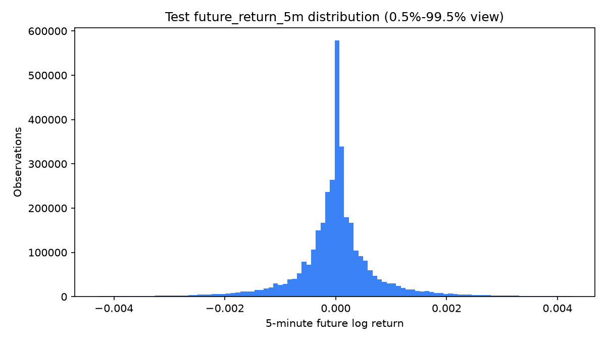
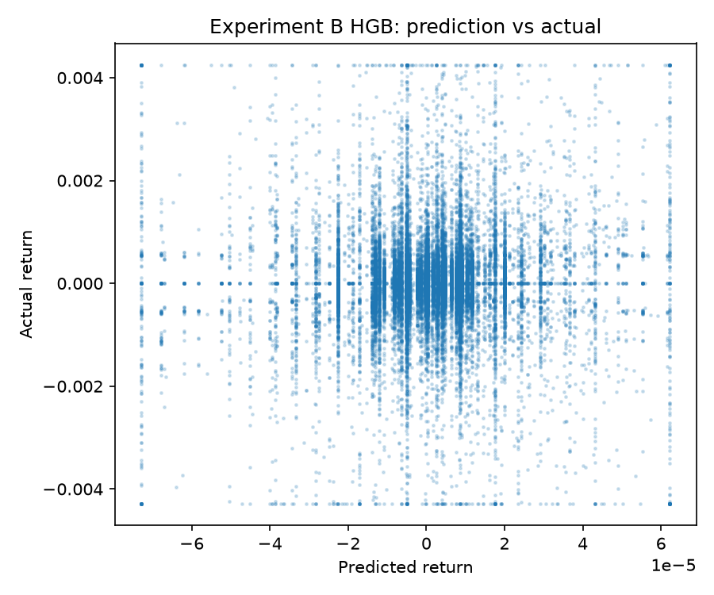
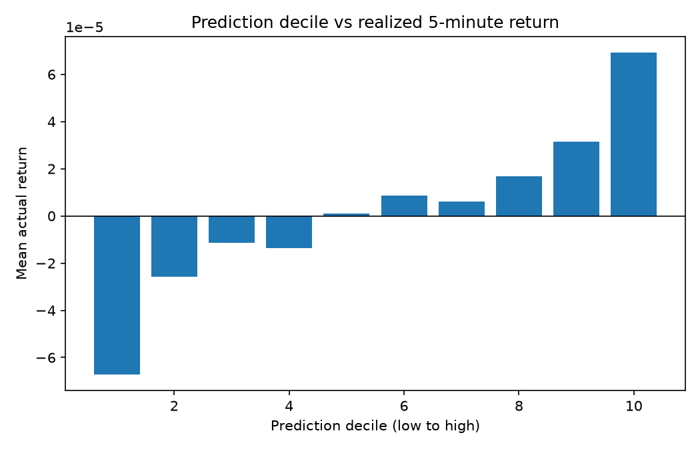
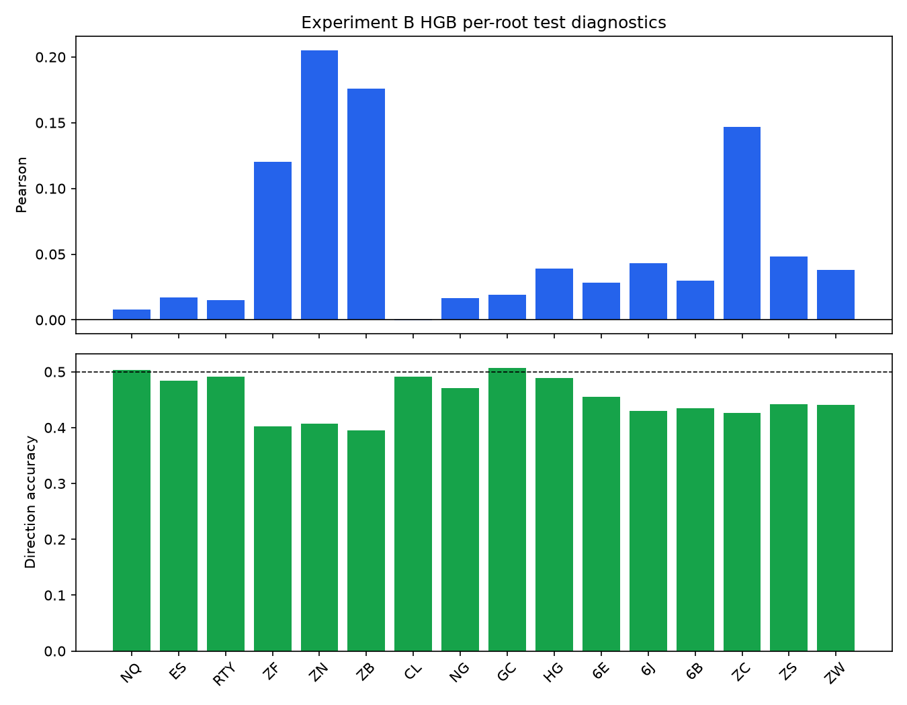

# Baseline Model Report

**Scope: predictive-signal diagnostics only. These results do not establish trading profitability.**

## Dataset and target

Sixteen roots, 2021-09-23 through 2026-09-22, primary target `future_return_5m`. Every target is an exact same-segment `ln(close[t+5m]/close[t])` observation.

## Train / validation / test

- Train/validation boundary: `2025-03-24T04:47:00+00:00`.
- Validation/test boundary: `2025-12-23T02:23:00+00:00`.
- Purge: `75` minutes on each side of both boundaries.
- Model fitting: 1,600,000 evenly spaced pooled train rows (100,000/root); no random shuffle.
- Validation and final test: every eligible row. Fixed defaults were selected before reading final test metrics.

## Pooled test results

| Experiment / model | N | MAE | RMSE | R² | Pearson | Spearman | Direction |
|---|---:|---:|---:|---:|---:|---:|---:|
| experiment_a / zero | 3,525,964 | 0.000542015 | 0.00109927 | -1.79719e-06 | undefined | undefined | 14.09% |
| experiment_a / ridge | 3,525,964 | 0.000543242 | 0.00109929 | -3.5621e-05 | 0.0188022 | 0.0593916 | 45.71% |
| experiment_a / hist_gradient_boosting | 3,525,964 | 0.000542542 | 0.001099 | 0.0004894 | 0.0223287 | 0.0674291 | 45.86% |
| experiment_b / ridge | 3,525,964 | 0.000543848 | 0.00109939 | -0.000230185 | 0.018727 | 0.0558863 | 45.45% |
| experiment_b / hist_gradient_boosting | 3,525,964 | 0.000542528 | 0.00109895 | 0.000575652 | 0.0240327 | 0.0672046 | 45.85% |

Experiment A is own-market OHLCV only. Experiment B adds the limited six-anchor exact-time layer. The best pooled R² is still only about 0.0006; the change from A to B is small and model/market dependent.

## Macro-average pooled test metrics

Each market contributes equally to these averages, irrespective of its observation count.

| Experiment / model | MAE | RMSE | R² | Pearson | Spearman | Direction |
|---|---:|---:|---:|---:|---:|---:|
| experiment_a / zero | 0.000546674 | 0.000860718 | -1.26701e-05 | undefined | undefined | 15.48% |
| experiment_a / ridge | 0.000548077 | 0.000860049 | 0.00390807 | 0.0522977 | 0.07573 | 45.29% |
| experiment_a / hist_gradient_boosting | 0.000547312 | 0.000859969 | 0.00334665 | 0.0581217 | 0.0819033 | 45.44% |
| experiment_b / ridge | 0.000548703 | 0.000860447 | 9.32415e-05 | 0.0422222 | 0.0677345 | 45.02% |
| experiment_b / hist_gradient_boosting | 0.000547293 | 0.000859964 | 0.00336258 | 0.0593482 | 0.0818025 | 45.44% |

## NQ-only test results

| Experiment / model | N | MAE | RMSE | R² | Pearson | Spearman | Direction |
|---|---:|---:|---:|---:|---:|---:|---:|
| experiment_a / zero | 263,560 | 0.000486035 | 0.000757314 | -1.88585e-05 | undefined | undefined | 0.91% |
| experiment_a / ridge | 263,560 | 0.000486555 | 0.000758048 | -0.0019599 | -0.000927652 | 0.0027346 | 49.48% |
| experiment_a / hist_gradient_boosting | 263,560 | 0.000486198 | 0.000757686 | -0.00100363 | 0.00530464 | 0.0084493 | 49.75% |
| experiment_b / ridge | 263,560 | 0.000487041 | 0.000758373 | -0.0028186 | 0.00248204 | 0.00320345 | 49.65% |
| experiment_b / hist_gradient_boosting | 263,560 | 0.000486229 | 0.000757622 | -0.000833209 | 0.00810977 | 0.00444931 | 49.77% |

The pooled models slightly outperform NQ-only HGB on NQ R² in Experiment A, but all NQ results remain near zero. Experiment B does not improve the pooled model's NQ test correlation in this run.

## Per-market pooled test metrics

### experiment_a / zero

| Root | N | MAE | RMSE | R² | Pearson | Spearman | Direction |
|---|---:|---:|---:|---:|---:|---:|---:|
| NQ | 263,560 | 0.000486035 | 0.000757314 | -1.88585e-05 | undefined | undefined | 0.91% |
| ES | 263,685 | 0.000322796 | 0.000523466 | -2.22906e-05 | undefined | undefined | 5.21% |
| RTY | 253,676 | 0.000496473 | 0.000815663 | -1.87312e-05 | undefined | undefined | 3.54% |
| ZF | 207,990 | 8.70419e-05 | 0.000140158 | -6.65869e-05 | undefined | undefined | 31.35% |
| ZN | 223,102 | 0.000132936 | 0.000206596 | -2.91557e-05 | undefined | undefined | 36.58% |
| ZB | 188,770 | 0.000263294 | 0.000395179 | -3.3541e-06 | undefined | undefined | 35.97% |
| CL | 257,057 | 0.00140054 | 0.00235928 | -3.77404e-06 | undefined | undefined | 4.52% |
| NG | 224,803 | 0.00145829 | 0.00229628 | -5.16054e-06 | undefined | undefined | 11.22% |
| GC | 258,798 | 0.000709252 | 0.00114394 | -4.24083e-06 | undefined | undefined | 1.36% |
| HG | 234,377 | 0.000748803 | 0.00113145 | -9.14941e-06 | undefined | undefined | 4.62% |
| 6E | 251,535 | 0.000148784 | 0.000227655 | -3.99403e-06 | undefined | undefined | 11.92% |
| 6J | 244,198 | 0.000175853 | 0.000302375 | -5.73542e-07 | undefined | undefined | 19.65% |
| 6B | 218,782 | 0.000179839 | 0.000269816 | -5.61222e-06 | undefined | undefined | 16.39% |
| ZC | 133,540 | 0.000686295 | 0.00104181 | -1.03798e-06 | undefined | undefined | 29.33% |
| ZS | 157,458 | 0.00050243 | 0.000761828 | -2.87341e-06 | undefined | undefined | 17.51% |
| ZW | 144,633 | 0.00094812 | 0.00139868 | -7.32868e-06 | undefined | undefined | 17.53% |

### experiment_a / ridge

| Root | N | MAE | RMSE | R² | Pearson | Spearman | Direction |
|---|---:|---:|---:|---:|---:|---:|---:|
| NQ | 263,560 | 0.000486243 | 0.000757694 | -0.00102268 | 0.00785985 | 0.0137899 | 50.27% |
| ES | 263,685 | 0.000323356 | 0.00052386 | -0.00152947 | 0.0081668 | 0.0177364 | 48.22% |
| RTY | 253,676 | 0.000496807 | 0.00081612 | -0.00113953 | 0.00640819 | 0.0181923 | 49.05% |
| ZF | 207,990 | 8.89644e-05 | 0.000139319 | 0.0118804 | 0.110904 | 0.15284 | 39.80% |
| ZN | 223,102 | 0.000135116 | 0.000203556 | 0.0291854 | 0.188407 | 0.234717 | 40.29% |
| ZB | 188,770 | 0.000265973 | 0.00039173 | 0.0173769 | 0.163668 | 0.201309 | 39.35% |
| CL | 257,057 | 0.00140089 | 0.0023615 | -0.00188073 | -0.01093 | 0.0218722 | 48.96% |
| NG | 224,803 | 0.00145979 | 0.0022964 | -0.00011179 | 0.0163865 | 0.047969 | 46.84% |
| GC | 258,798 | 0.000708918 | 0.00114398 | -6.96651e-05 | 0.0172085 | 0.0284822 | 50.53% |
| HG | 234,377 | 0.000748906 | 0.00113086 | 0.00104262 | 0.0327604 | 0.029712 | 48.88% |
| 6E | 251,535 | 0.000150005 | 0.00022798 | -0.00286538 | 0.0264765 | 0.0353133 | 45.46% |
| 6J | 244,198 | 0.000177544 | 0.000302414 | -0.000258728 | 0.0331959 | 0.0699024 | 43.23% |
| 6B | 218,782 | 0.000181467 | 0.000269964 | -0.00109842 | 0.0299885 | 0.0409595 | 43.43% |
| ZC | 133,540 | 0.000689492 | 0.00103672 | 0.00973968 | 0.124491 | 0.175606 | 42.48% |
| ZS | 157,458 | 0.000504494 | 0.000761236 | 0.00155042 | 0.0399237 | 0.0637348 | 43.98% |
| ZW | 144,633 | 0.000951271 | 0.00139746 | 0.00173015 | 0.0418483 | 0.0595436 | 43.86% |

### experiment_a / hist_gradient_boosting

| Root | N | MAE | RMSE | R² | Pearson | Spearman | Direction |
|---|---:|---:|---:|---:|---:|---:|---:|
| NQ | 263,560 | 0.000485963 | 0.00075725 | 0.000148235 | 0.0125626 | 0.0162562 | 50.34% |
| ES | 263,685 | 0.000322974 | 0.000523372 | 0.000335763 | 0.0186139 | 0.0193455 | 48.41% |
| RTY | 253,676 | 0.000496562 | 0.000815719 | -0.000155053 | 0.00406197 | 0.0184784 | 49.06% |
| ZF | 207,990 | 8.76652e-05 | 0.000139434 | 0.0102367 | 0.119691 | 0.166315 | 40.18% |
| ZN | 223,102 | 0.000133619 | 0.000204932 | 0.0160168 | 0.202287 | 0.253229 | 40.66% |
| ZB | 188,770 | 0.000264242 | 0.000393214 | 0.00991566 | 0.172653 | 0.212849 | 39.56% |
| CL | 257,057 | 0.00140065 | 0.00236003 | -0.000636871 | 0.00100038 | 0.0271778 | 49.17% |
| NG | 224,803 | 0.00145923 | 0.00229627 | -2.77652e-06 | 0.0132739 | 0.0510421 | 47.13% |
| GC | 258,798 | 0.000709068 | 0.001144 | -0.000108263 | 0.00804384 | 0.0312869 | 50.66% |
| HG | 234,377 | 0.000748815 | 0.0011309 | 0.000962605 | 0.0347457 | 0.0306109 | 48.89% |
| 6E | 251,535 | 0.000149282 | 0.000227581 | 0.00064476 | 0.0277729 | 0.0386633 | 45.57% |
| 6J | 244,198 | 0.000176544 | 0.000302149 | 0.00149555 | 0.0395993 | 0.0753037 | 43.03% |
| 6B | 218,782 | 0.000180529 | 0.000269727 | 0.00065543 | 0.0269933 | 0.0418713 | 43.47% |
| ZC | 133,540 | 0.000689083 | 0.00103616 | 0.0108129 | 0.149609 | 0.191002 | 42.65% |
| ZS | 157,458 | 0.000503343 | 0.000761209 | 0.00162062 | 0.0481209 | 0.0686026 | 44.23% |
| ZW | 144,633 | 0.000949433 | 0.00139755 | 0.00160434 | 0.0509189 | 0.0684185 | 44.07% |

### experiment_b / ridge

| Root | N | MAE | RMSE | R² | Pearson | Spearman | Direction |
|---|---:|---:|---:|---:|---:|---:|---:|
| NQ | 263,560 | 0.000486399 | 0.000757875 | -0.00150056 | 0.00899148 | 0.0146591 | 50.29% |
| ES | 263,685 | 0.000323658 | 0.000524214 | -0.00288302 | 0.00690067 | 0.0176857 | 48.17% |
| RTY | 253,676 | 0.000497039 | 0.000816523 | -0.00212835 | 0.00263613 | 0.0190165 | 49.11% |
| ZF | 207,990 | 9.09976e-05 | 0.000141262 | -0.01588 | 0.0669945 | 0.115767 | 38.78% |
| ZN | 223,102 | 0.000137021 | 0.000204802 | 0.0172629 | 0.133441 | 0.188272 | 38.69% |
| ZB | 188,770 | 0.00026784 | 0.000392199 | 0.0150196 | 0.127762 | 0.169006 | 38.04% |
| CL | 257,057 | 0.00140088 | 0.00236166 | -0.00201454 | -0.013999 | 0.0221128 | 48.99% |
| NG | 224,803 | 0.00145976 | 0.00229614 | 0.000116018 | 0.0207758 | 0.0501517 | 46.93% |
| GC | 258,798 | 0.000709256 | 0.00114427 | -0.000584128 | 0.0103962 | 0.0204427 | 50.28% |
| HG | 234,377 | 0.000748876 | 0.00113089 | 0.000985639 | 0.0326516 | 0.0328837 | 49.11% |
| 6E | 251,535 | 0.000150648 | 0.000228811 | -0.0101839 | 0.0179844 | 0.029022 | 45.32% |
| 6J | 244,198 | 0.000178577 | 0.000303255 | -0.00583129 | 0.0206353 | 0.0563382 | 42.69% |
| 6B | 218,782 | 0.000182077 | 0.000270511 | -0.00516044 | 0.0286117 | 0.0425407 | 43.58% |
| ZC | 133,540 | 0.000690045 | 0.00103629 | 0.0105609 | 0.123964 | 0.173282 | 42.12% |
| ZS | 157,458 | 0.000504687 | 0.000761157 | 0.00175794 | 0.0433984 | 0.068701 | 44.16% |
| ZW | 144,633 | 0.000951485 | 0.0013973 | 0.00195513 | 0.044411 | 0.0638695 | 44.04% |

### experiment_b / hist_gradient_boosting

| Root | N | MAE | RMSE | R² | Pearson | Spearman | Direction |
|---|---:|---:|---:|---:|---:|---:|---:|
| NQ | 263,560 | 0.000485977 | 0.000757295 | 2.95619e-05 | 0.00794731 | 0.0160645 | 50.35% |
| ES | 263,685 | 0.00032296 | 0.000523389 | 0.000272664 | 0.0168477 | 0.0191826 | 48.38% |
| RTY | 253,676 | 0.00049655 | 0.000815568 | 0.000214983 | 0.0150888 | 0.0192688 | 49.11% |
| ZF | 207,990 | 8.76655e-05 | 0.000139439 | 0.0101707 | 0.120242 | 0.166245 | 40.18% |
| ZN | 223,102 | 0.000133609 | 0.000204905 | 0.0162713 | 0.205212 | 0.254441 | 40.67% |
| ZB | 188,770 | 0.000264231 | 0.000393264 | 0.00966643 | 0.175732 | 0.213764 | 39.56% |
| CL | 257,057 | 0.00140065 | 0.0023599 | -0.000523417 | -0.000310168 | 0.0248332 | 49.11% |
| NG | 224,803 | 0.00145926 | 0.00229605 | 0.000187209 | 0.0163992 | 0.0500533 | 47.11% |
| GC | 258,798 | 0.000709049 | 0.00114374 | 0.000354183 | 0.0190509 | 0.0330465 | 50.69% |
| HG | 234,377 | 0.000748807 | 0.00113085 | 0.00105685 | 0.0392423 | 0.0311254 | 48.86% |
| 6E | 251,535 | 0.000149273 | 0.000227577 | 0.000682273 | 0.0281699 | 0.0390712 | 45.57% |
| 6J | 244,198 | 0.000176541 | 0.000302117 | 0.00170197 | 0.0431194 | 0.0751894 | 43.04% |
| 6B | 218,782 | 0.000180523 | 0.000269699 | 0.000866595 | 0.029855 | 0.0421137 | 43.47% |
| ZC | 133,540 | 0.00068893 | 0.00103643 | 0.0102944 | 0.146711 | 0.188944 | 42.64% |
| ZS | 157,458 | 0.000503266 | 0.000761242 | 0.00153512 | 0.0482186 | 0.0694433 | 44.24% |
| ZW | 144,633 | 0.00094939 | 0.00139796 | 0.00102056 | 0.0380456 | 0.0660541 | 44.06% |

## Prediction-decile analysis

| Decile | N | Mean prediction | Mean realized return |
|---:|---:|---:|---:|
| 1 | 352,597 | -3.45181e-05 | -6.7198e-05 |
| 2 | 352,597 | -1.21068e-05 | -2.58441e-05 |
| 3 | 352,597 | -7.1487e-06 | -1.13673e-05 |
| 4 | 352,597 | -3.84699e-06 | -1.37556e-05 |
| 5 | 352,596 | 7.28817e-08 | 8.86477e-07 |
| 6 | 352,596 | 1.70789e-06 | 8.62299e-06 |
| 7 | 352,596 | 5.4971e-06 | 5.96143e-06 |
| 8 | 352,596 | 8.77511e-06 | 1.66719e-05 |
| 9 | 352,596 | 1.1566e-05 | 3.14524e-05 |
| 10 | 352,596 | 3.42946e-05 | 6.93069e-05 |

## Rollover and leakage safeguards

All 440 transitions reconcile. Features/labels join on exact timestamp plus segment; stateful features group by segment; a 240-bar post-roll warm-up and exact target are required. Global timestamps, 75-minute purges, train-only imputation/scaling/encoding, explicit label exclusion, and untouched final-test evaluation are enforced in code and tests.

## 1-minute and 15-minute target diagnostics

`future_return_1m` and `future_return_15m` are retained and audited, but the optional extra model runs were not executed. Compute and documentation effort remained focused on the primary 5-minute benchmark, as permitted by the Phase 2 brief.

## Scientific interpretation

The nonlinear pooled models show very weak positive aggregate correlation and tiny positive R²; linear and NQ-only results are generally at or below the zero predictor on squared error. Cross-market context produces a small pooled aggregate improvement for HGB but not a robust improvement across every root or for NQ. This is evidence for, at most, a weak predictive association—not an executable trading edge.

Fees, bid/ask spread, slippage, turnover, execution timing, position sizing, risk limits, and signal thresholds are absent by design. No strategy, backtest, PnL, or live integration was implemented.

## Diagnostic figures

## Recommended next research step

Review Phase 2 results and the weakest/strongest per-root behavior before authorizing another phase. A later scoped study could test target horizon or market-specific sampling sensitivity; it should not begin with strategy or execution claims.
