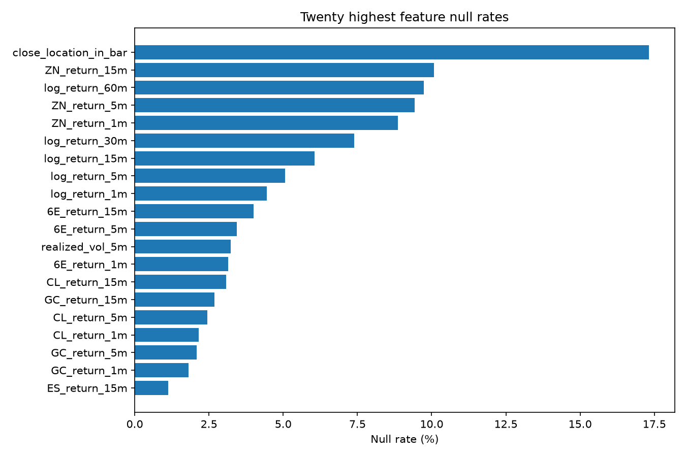

# Feature Report

**Feature-set version: `phase2_v1`. Every calculation is causal and grouped by contiguous `contract_segment_id`.**

Experiment A has 35 model inputs derived only from the predicted market's OHLCV. Experiment B adds 18 anchor returns (NQ, ES, ZN, CL, GC, 6E × 1/5/15 minutes) and the NQ-minus-ES 5-minute spread, for 54 numeric inputs. Statistics and Status are not model inputs.

## Feature distributions and availability

Distribution columns use a deterministic 1-in-200-row sample across all 16 roots; null rates use every row. Min/max are retained as extreme-value checks, while p01/p99 show the typical range.

| Feature | Experiment | Null % | Min | P01 | Median | P99 | Max |
|---|---|---:|---:|---:|---:|---:|---:|
| `log_return_1m` | A,B | 4.445 | -0.017816 | -0.0014055 | 0 | 0.0014027 | 0.011338 |
| `log_return_5m` | A,B | 5.067 | -0.020683 | -0.0030607 | 0 | 0.003038 | 0.025059 |
| `log_return_15m` | A,B | 6.056 | -0.038652 | -0.0052946 | 0 | 0.0052252 | 0.03966 |
| `log_return_30m` | A,B | 7.384 | -0.08464 | -0.0073943 | 0 | 0.007406 | 0.063675 |
| `log_return_60m` | A,B | 9.743 | -0.10673 | -0.01068 | 0 | 0.010338 | 0.076912 |
| `return_open_to_close` | A,B | 0.000 | -0.017201 | -0.001331 | 0 | 0.0013388 | 0.011402 |
| `range_pct` | A,B | 0.000 | 0 | 0 | 0.0002078 | 0.0027199 | 0.025071 |
| `upper_wick_pct` | A,B | 0.000 | 0 | 0 | 0 | 0.00085916 | 0.01496 |
| `lower_wick_pct` | A,B | 0.000 | 0 | 0 | 0 | 0.00086281 | 0.0080142 |
| `close_location_in_bar` | A,B | 17.315 | 0 | 0 | 0.5 | 1 | 1 |
| `close_to_ema_5` | A,B | 0.007 | -0.029376 | -0.0012326 | 4.105e-07 | 0.0012258 | 0.0086974 |
| `close_to_ema_20` | A,B | 0.034 | -0.1212 | -0.0028758 | 2.419e-06 | 0.0029023 | 0.028816 |
| `close_to_ema_50` | A,B | 0.089 | -0.15744 | -0.004752 | 3.6964e-06 | 0.0047282 | 0.048409 |
| `ema5_vs_ema20` | A,B | 0.034 | -0.091828 | -0.0020439 | 1.0708e-06 | 0.0020453 | 0.027315 |
| `ema20_vs_ema50` | A,B | 0.089 | -0.036233 | -0.0025028 | 1.799e-06 | 0.0024353 | 0.019593 |
| `rsi_14` | A,B | 0.025 | 0 | 12.5 | 50 | 87.5 | 100 |
| `atr_14_normalized` | A,B | 0.024 | 0 | 3.2284e-05 | 0.00024968 | 0.0023915 | 0.018269 |
| `realized_vol_5m` | A,B | 3.232 | 0 | 0 | 0.00017614 | 0.0018319 | 0.012309 |
| `realized_vol_15m` | A,B | 0.586 | 0 | 3.0285e-05 | 0.00019452 | 0.00175 | 0.011811 |
| `realized_vol_60m` | A,B | 0.186 | 0 | 4.2165e-05 | 0.00020877 | 0.001742 | 0.012461 |
| `volume` | A,B | 0.000 | 1 | 1 | 63 | 4435 | 89591 |
| `rolling_volume_mean_20` | A,B | 0.034 | 1.45 | 4.1 | 86.3 | 3839.7 | 31014 |
| `rolling_volume_mean_60` | A,B | 0.107 | 1.75 | 5.2167 | 92.65 | 3725.8 | 16474 |
| `volume_zscore_20` | A,B | 0.034 | -2.3721 | -1.4197 | -0.30869 | 3.5904 | 4.2482 |
| `volume_zscore_60` | A,B | 0.107 | -2.1229 | -1.2628 | -0.29957 | 4.4105 | 7.6117 |
| `relative_volume_20` | A,B | 0.034 | 0.00035868 | 0.014364 | 0.75767 | 5.4167 | 18.792 |
| `close_minus_vwap_60m_pct` | A,B | 0.107 | -0.10289 | -0.0054208 | 6.4086e-06 | 0.0053868 | 0.031624 |
| `close_minus_vwap_240m_pct` | A,B | 0.432 | -0.17233 | -0.011054 | 1.8043e-05 | 0.010793 | 0.077963 |
| `chicago_hour` | A,B | 0.000 | 0 | 0 | 10 | 23 | 23 |
| `chicago_minute` | A,B | 0.000 | 0 | 0 | 29 | 59 | 59 |
| `chicago_day_of_week` | A,B | 0.000 | 0 | 0 | 2 | 6 | 6 |
| `hour_sin` | A,B | 0.000 | -1 | -0.99923 | 0.16505 | 0.99953 | 1 |
| `hour_cos` | A,B | 0.000 | -1 | -0.99966 | 0.056693 | 0.99939 | 1 |
| `day_of_week_sin` | A,B | 0.000 | -0.78183 | -0.78183 | 0.43388 | 0.97493 | 0.97493 |
| `day_of_week_cos` | A,B | 0.000 | -0.90097 | -0.90097 | -0.22252 | 1 | 1 |
| `NQ_return_1m` | B | 0.245 | -0.0084254 | -0.0011165 | 0 | 0.0010771 | 0.0096852 |
| `NQ_return_5m` | B | 0.501 | -0.036717 | -0.0025574 | 1.0505e-05 | 0.0024899 | 0.025303 |
| `NQ_return_15m` | B | 1.102 | -0.037022 | -0.0044072 | 2.4289e-05 | 0.0043259 | 0.063775 |
| `ES_return_1m` | B | 0.270 | -0.0082405 | -0.00084589 | 0 | 0.00082132 | 0.0081495 |
| `ES_return_5m` | B | 0.526 | -0.034362 | -0.001925 | 0 | 0.0018777 | 0.019692 |
| `ES_return_15m` | B | 1.128 | -0.02916 | -0.0033429 | 0 | 0.0032648 | 0.058057 |
| `ZN_return_1m` | B | 8.871 | -0.0067312 | -0.00037648 | 0 | 0.00029507 | 0.0069475 |
| `ZN_return_5m` | B | 9.425 | -0.0094394 | -0.00070776 | 0 | 0.00070457 | 0.0069475 |
| `ZN_return_15m` | B | 10.085 | -0.0097364 | -0.0012434 | 0 | 0.0012314 | 0.0083925 |
| `CL_return_1m` | B | 2.152 | -0.02619 | -0.0020308 | 0 | 0.0020095 | 0.022009 |
| `CL_return_5m` | B | 2.453 | -0.049308 | -0.004529 | 0 | 0.0044188 | 0.033446 |
| `CL_return_15m` | B | 3.075 | -0.083178 | -0.0079682 | 0 | 0.0075312 | 0.06233 |
| `GC_return_1m` | B | 1.807 | -0.011413 | -0.00086957 | 0 | 0.00089127 | 0.0068002 |
| `GC_return_5m` | B | 2.089 | -0.017968 | -0.0019294 | 0 | 0.0019204 | 0.019227 |
| `GC_return_15m` | B | 2.688 | -0.028188 | -0.0034007 | 0 | 0.0033357 | 0.021058 |
| `6E_return_1m` | B | 3.144 | -0.0045259 | -0.0003815 | 0 | 0.0003753 | 0.0050163 |
| `6E_return_5m` | B | 3.437 | -0.0097572 | -0.00082353 | 0 | 0.00083806 | 0.0060506 |
| `6E_return_15m` | B | 4.000 | -0.011915 | -0.0014314 | 0 | 0.0014627 | 0.0082223 |
| `NQ_ES_return_spread_5m` | B | 0.556 | -0.0094056 | -0.00098485 | 1.2341e-06 | 0.00097841 | 0.0062695 |

All finite-value guards passed. Extreme min/max observations remain visible rather than silently clipped; Ridge scaling and imputation are learned only from train, and HGB uses train-median imputation without scaling.

## Per-root availability

Availability is the percentage of feature cells that are non-null before train-only imputation.

| Root | Own-feature availability | Cross-feature availability | ML eligible rows | Eligible % |
|---|---:|---:|---:|---:|
| NQ | 99.73% | 96.50% | 1,757,951 | 99.33% |
| ES | 99.69% | 96.50% | 1,757,391 | 99.31% |
| RTY | 99.16% | 96.67% | 1,663,353 | 96.90% |
| ZF | 97.66% | 97.16% | 1,485,882 | 92.47% |
| ZN | 98.20% | 97.55% | 1,574,020 | 94.58% |
| ZB | 96.91% | 97.28% | 1,379,731 | 89.61% |
| CL | 99.37% | 96.71% | 1,706,946 | 97.72% |
| NG | 97.89% | 96.82% | 1,439,345 | 90.87% |
| GC | 99.57% | 96.67% | 1,725,650 | 98.69% |
| HG | 98.83% | 96.77% | 1,606,494 | 95.49% |
| 6E | 99.15% | 96.68% | 1,696,086 | 97.55% |
| 6J | 99.01% | 96.43% | 1,686,636 | 97.33% |
| 6B | 98.02% | 96.89% | 1,521,400 | 93.27% |
| ZC | 95.76% | 98.14% | 893,567 | 84.55% |
| ZS | 97.23% | 97.89% | 1,066,090 | 90.64% |
| ZW | 95.77% | 98.15% | 872,182 | 83.79% |

## Formulas and provenance

| Feature | Formula | Source | Lookback | Normalization | Code |
|---|---|---|---|---|---|
| `log_return_1m` | ln(close[t] / close[t-1m]) | close, timestamp, contract_segment_id | exact 1 clock minutes | log ratio | `features.ohlcv_features.add_exact_log_returns` |
| `log_return_5m` | ln(close[t] / close[t-5m]) | close, timestamp, contract_segment_id | exact 5 clock minutes | log ratio | `features.ohlcv_features.add_exact_log_returns` |
| `log_return_15m` | ln(close[t] / close[t-15m]) | close, timestamp, contract_segment_id | exact 15 clock minutes | log ratio | `features.ohlcv_features.add_exact_log_returns` |
| `log_return_30m` | ln(close[t] / close[t-30m]) | close, timestamp, contract_segment_id | exact 30 clock minutes | log ratio | `features.ohlcv_features.add_exact_log_returns` |
| `log_return_60m` | ln(close[t] / close[t-60m]) | close, timestamp, contract_segment_id | exact 60 clock minutes | log ratio | `features.ohlcv_features.add_exact_log_returns` |
| `return_open_to_close` | (close-open)/open | open, close | current bar | ratio | `features.ohlcv_features.add_candle_features` |
| `range_pct` | (high-low)/close | high, low, close | current bar | ratio | `features.ohlcv_features.add_candle_features` |
| `upper_wick_pct` | (high-max(open,close))/close | open, high, close | current bar | ratio | `features.ohlcv_features.add_candle_features` |
| `lower_wick_pct` | (min(open,close)-low)/close | open, low, close | current bar | ratio | `features.ohlcv_features.add_candle_features` |
| `close_location_in_bar` | (close-low)/(high-low) | high, low, close | current bar | unit interval | `features.ohlcv_features.add_candle_features` |
| `close_to_ema_5` | ln(close/EMA_5) | close | 5 observations | log ratio | `features.ohlcv_features.add_trend_features` |
| `close_to_ema_20` | ln(close/EMA_20) | close | 20 observations | log ratio | `features.ohlcv_features.add_trend_features` |
| `close_to_ema_50` | ln(close/EMA_50) | close | 50 observations | log ratio | `features.ohlcv_features.add_trend_features` |
| `ema5_vs_ema20` | ln(EMA_5/EMA_20) | close | 20 observations | log ratio | `features.ohlcv_features.add_trend_features` |
| `ema20_vs_ema50` | ln(EMA_20/EMA_50) | close | 50 observations | log ratio | `features.ohlcv_features.add_trend_features` |
| `rsi_14` | 100-100/(1+mean(gain,14)/mean(loss,14)) | close | 14 observations | 0 to 100 | `features.ohlcv_features.add_trend_features` |
| `atr_14_normalized` | mean(true_range,14)/close | high, low, close | 14 observations | price ratio | `features.ohlcv_features.add_volatility_features` |
| `realized_vol_5m` | std(log_return_1m) over (t-5m,t] | close, timestamp | 5 clock minutes | standard deviation | `features.ohlcv_features.add_volatility_features` |
| `realized_vol_15m` | std(log_return_1m) over (t-15m,t] | close, timestamp | 15 clock minutes | standard deviation | `features.ohlcv_features.add_volatility_features` |
| `realized_vol_60m` | std(log_return_1m) over (t-60m,t] | close, timestamp | 60 clock minutes | standard deviation | `features.ohlcv_features.add_volatility_features` |
| `volume` | current bar volume | volume | current bar | none | `features.ohlcv_features.add_volume_features` |
| `rolling_volume_mean_20` | mean(volume,20) | volume | 20 observations | none | `features.ohlcv_features.add_volume_features` |
| `rolling_volume_mean_60` | mean(volume,60) | volume | 60 observations | none | `features.ohlcv_features.add_volume_features` |
| `volume_zscore_20` | (volume-mean20)/std20 | volume | 20 observations | z-score | `features.ohlcv_features.add_volume_features` |
| `volume_zscore_60` | (volume-mean60)/std60 | volume | 60 observations | z-score | `features.ohlcv_features.add_volume_features` |
| `relative_volume_20` | volume/mean20 | volume | 20 observations | ratio | `features.ohlcv_features.add_volume_features` |
| `close_minus_vwap_60m_pct` | (close-bar_vwap60)/close | high, low, close, volume | 60 observations | price ratio | `features.ohlcv_features.add_vwap_features` |
| `close_minus_vwap_240m_pct` | (close-bar_vwap240)/close | high, low, close, volume | 240 observations | price ratio | `features.ohlcv_features.add_vwap_features` |
| `chicago_hour` | Chicago local hour | timestamp | current bar | none | `features.ohlcv_features.add_time_features` |
| `chicago_minute` | Chicago local minute | timestamp | current bar | none | `features.ohlcv_features.add_time_features` |
| `chicago_day_of_week` | Chicago weekday 0=Monday | timestamp | current bar | none | `features.ohlcv_features.add_time_features` |
| `hour_sin` | sin(2*pi*minute_of_day/1440) | timestamp | current bar | cyclical | `features.ohlcv_features.add_time_features` |
| `hour_cos` | cos(2*pi*minute_of_day/1440) | timestamp | current bar | cyclical | `features.ohlcv_features.add_time_features` |
| `day_of_week_sin` | sin(2*pi*weekday/7) | timestamp | current bar | cyclical | `features.ohlcv_features.add_time_features` |
| `day_of_week_cos` | cos(2*pi*weekday/7) | timestamp | current bar | cyclical | `features.ohlcv_features.add_time_features` |
| `NQ_return_1m` | anchor exact-time log return | timestamp, anchor log return | encoded in name | log return | `features.cross_market.add_cross_market_features` |
| `NQ_return_5m` | anchor exact-time log return | timestamp, anchor log return | encoded in name | log return | `features.cross_market.add_cross_market_features` |
| `NQ_return_15m` | anchor exact-time log return | timestamp, anchor log return | encoded in name | log return | `features.cross_market.add_cross_market_features` |
| `ES_return_1m` | anchor exact-time log return | timestamp, anchor log return | encoded in name | log return | `features.cross_market.add_cross_market_features` |
| `ES_return_5m` | anchor exact-time log return | timestamp, anchor log return | encoded in name | log return | `features.cross_market.add_cross_market_features` |
| `ES_return_15m` | anchor exact-time log return | timestamp, anchor log return | encoded in name | log return | `features.cross_market.add_cross_market_features` |
| `ZN_return_1m` | anchor exact-time log return | timestamp, anchor log return | encoded in name | log return | `features.cross_market.add_cross_market_features` |
| `ZN_return_5m` | anchor exact-time log return | timestamp, anchor log return | encoded in name | log return | `features.cross_market.add_cross_market_features` |
| `ZN_return_15m` | anchor exact-time log return | timestamp, anchor log return | encoded in name | log return | `features.cross_market.add_cross_market_features` |
| `CL_return_1m` | anchor exact-time log return | timestamp, anchor log return | encoded in name | log return | `features.cross_market.add_cross_market_features` |
| `CL_return_5m` | anchor exact-time log return | timestamp, anchor log return | encoded in name | log return | `features.cross_market.add_cross_market_features` |
| `CL_return_15m` | anchor exact-time log return | timestamp, anchor log return | encoded in name | log return | `features.cross_market.add_cross_market_features` |
| `GC_return_1m` | anchor exact-time log return | timestamp, anchor log return | encoded in name | log return | `features.cross_market.add_cross_market_features` |
| `GC_return_5m` | anchor exact-time log return | timestamp, anchor log return | encoded in name | log return | `features.cross_market.add_cross_market_features` |
| `GC_return_15m` | anchor exact-time log return | timestamp, anchor log return | encoded in name | log return | `features.cross_market.add_cross_market_features` |
| `6E_return_1m` | anchor exact-time log return | timestamp, anchor log return | encoded in name | log return | `features.cross_market.add_cross_market_features` |
| `6E_return_5m` | anchor exact-time log return | timestamp, anchor log return | encoded in name | log return | `features.cross_market.add_cross_market_features` |
| `6E_return_15m` | anchor exact-time log return | timestamp, anchor log return | encoded in name | log return | `features.cross_market.add_cross_market_features` |
| `NQ_ES_return_spread_5m` | NQ_return_5m - ES_return_5m | timestamp, anchor log return | 5 clock minutes | log return | `features.cross_market.add_cross_market_features` |

## Rollover and missingness behavior

Exact return features self-join on `(contract_segment_id, timestamp)`; row offsets are never used. EMA, RSI, ATR, rolling volume, realized volatility, and VWAP are evaluated within a segment. Experiment B is a plain equality join on UTC timestamp: no as-of join and no stale forward fill.

