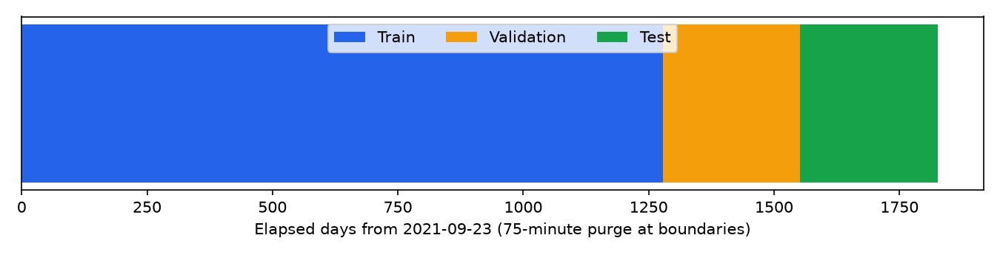

# ML Dataset Walkthrough

## What the model sees

For one eligible observation at time `t`, `x_t = [feature_1, ..., feature_D]` contains past/current information only and `y_t = future_return_5m = ln(close[t+5m] / close[t])`. Stacking observations gives `X ∈ R^(N×D)` and `y ∈ R^N`; `N` is observations and `D` is input columns after preprocessing.

## Actual shapes

Global boundaries are train before `2025-03-24T04:47:00+00:00`, validation between the purged boundaries, and test from `2025-12-23T02:23:00+00:00` onward. A 75-minute exclusion is applied on both sides of each boundary.

- Experiment A eligible `X_train`: `(16,812,886, 36)` before encoding; `y_train`: `(16,812,886,)`.
- Experiment A bounded baseline-fit `X_train`: `(1,600,000, 36)`; after pooled root one-hot: `(1,600,000, 51)`.
- `X_val`: `(3,490,684, 36)`; `y_val`: `(3,490,684,)`.
- `X_test`: `(3,525,964, 36)`; `y_test`: `(3,525,964,)`.
- Experiment B has 55 pre-encoding columns (54 numeric + root) and 70 after pooled one-hot encoding.

The complete dataset is retained. Baseline fitting uses a deterministic evenly spaced cap of 100,000 train rows per root (1.6 million pooled) to keep HGB practical; validation and test metrics use every eligible row.

## One real NQ training observation

Timestamp `2021-09-23T03:59:00+00:00`, root `NQ`, instrument `2770`, segment `1`.

| Column | Actual value | Classification |
|---|---:|---|
| `log_return_1m` | -8.232011e-05 | MODEL INPUT FEATURE |
| `log_return_5m` | -0.00014817132 | MODEL INPUT FEATURE |
| `rsi_14` | 29.545455 | MODEL INPUT FEATURE |
| `atr_14_normalized` | 9.8788198e-05 | MODEL INPUT FEATURE |
| `volume_zscore_20` | -1.3647408 | MODEL INPUT FEATURE |
| `close_minus_vwap_60m_pct` | -0.0004445401 | MODEL INPUT FEATURE |
| `ES_return_5m` | -0.00022757012 | MODEL INPUT FEATURE |
| `ZN_return_5m` | undefined | MODEL INPUT FEATURE |
| `hour_sin` | -0.26303121 | MODEL INPUT FEATURE |
| `hour_cos` | 0.96478732 | MODEL INPUT FEATURE |
| `future_return_1m` | 6.585663e-05 | FORBIDDEN FROM MODEL INPUT |
| `future_return_5m` | 0.00036215781 | TARGET |
| `future_return_15m` | 0.00031278037 | FORBIDDEN FROM MODEL INPUT |
| `direction_5m` | UP | FORBIDDEN diagnostic label |
| `root` | NQ | METADATA + pooled one-hot identity |
| `timestamp` | 2021-09-23T03:59:00+00:00 | METADATA |

## Raw → X,y code map

```text
DBN -- data.processed.read_root_ohlcv --> canonical bars
     -- data.processed.add_contract_segments --> rollover-safe segments
     -- features.ohlcv_features.build_own_market_features --> Experiment A X
     -- labels.future_returns.add_future_labels --> y horizons
     -- features.cross_market.add_cross_market_features --> Experiment B X
     -- features.pipeline.eligibility_expression --> eligible observations
     -- evaluation.splits.split_expression --> train / validation / test
     -- models.baselines.make_*_pipeline --> train-fitted preprocessing
     -- Pipeline.fit / Pipeline.predict --> predictions
     -- evaluation.metrics.regression_metrics --> unseen-future metrics
```

## Feature and label contract

| Name | Kind | Formula | Source | Lookback/horizon | Normalized | Experiment | Code |
|---|---|---|---|---|---|---|---|
| `log_return_1m` | feature | ln(close[t] / close[t-1m]) | close, timestamp, contract_segment_id | exact 1 clock minutes | log ratio | A,B | `features.ohlcv_features.add_exact_log_returns` |
| `log_return_5m` | feature | ln(close[t] / close[t-5m]) | close, timestamp, contract_segment_id | exact 5 clock minutes | log ratio | A,B | `features.ohlcv_features.add_exact_log_returns` |
| `log_return_15m` | feature | ln(close[t] / close[t-15m]) | close, timestamp, contract_segment_id | exact 15 clock minutes | log ratio | A,B | `features.ohlcv_features.add_exact_log_returns` |
| `log_return_30m` | feature | ln(close[t] / close[t-30m]) | close, timestamp, contract_segment_id | exact 30 clock minutes | log ratio | A,B | `features.ohlcv_features.add_exact_log_returns` |
| `log_return_60m` | feature | ln(close[t] / close[t-60m]) | close, timestamp, contract_segment_id | exact 60 clock minutes | log ratio | A,B | `features.ohlcv_features.add_exact_log_returns` |
| `return_open_to_close` | feature | (close-open)/open | open, close | current bar | ratio | A,B | `features.ohlcv_features.add_candle_features` |
| `range_pct` | feature | (high-low)/close | high, low, close | current bar | ratio | A,B | `features.ohlcv_features.add_candle_features` |
| `upper_wick_pct` | feature | (high-max(open,close))/close | open, high, close | current bar | ratio | A,B | `features.ohlcv_features.add_candle_features` |
| `lower_wick_pct` | feature | (min(open,close)-low)/close | open, low, close | current bar | ratio | A,B | `features.ohlcv_features.add_candle_features` |
| `close_location_in_bar` | feature | (close-low)/(high-low) | high, low, close | current bar | unit interval | A,B | `features.ohlcv_features.add_candle_features` |
| `close_to_ema_5` | feature | ln(close/EMA_5) | close | 5 observations | log ratio | A,B | `features.ohlcv_features.add_trend_features` |
| `close_to_ema_20` | feature | ln(close/EMA_20) | close | 20 observations | log ratio | A,B | `features.ohlcv_features.add_trend_features` |
| `close_to_ema_50` | feature | ln(close/EMA_50) | close | 50 observations | log ratio | A,B | `features.ohlcv_features.add_trend_features` |
| `ema5_vs_ema20` | feature | ln(EMA_5/EMA_20) | close | 20 observations | log ratio | A,B | `features.ohlcv_features.add_trend_features` |
| `ema20_vs_ema50` | feature | ln(EMA_20/EMA_50) | close | 50 observations | log ratio | A,B | `features.ohlcv_features.add_trend_features` |
| `rsi_14` | feature | 100-100/(1+mean(gain,14)/mean(loss,14)) | close | 14 observations | 0 to 100 | A,B | `features.ohlcv_features.add_trend_features` |
| `atr_14_normalized` | feature | mean(true_range,14)/close | high, low, close | 14 observations | price ratio | A,B | `features.ohlcv_features.add_volatility_features` |
| `realized_vol_5m` | feature | std(log_return_1m) over (t-5m,t] | close, timestamp | 5 clock minutes | standard deviation | A,B | `features.ohlcv_features.add_volatility_features` |
| `realized_vol_15m` | feature | std(log_return_1m) over (t-15m,t] | close, timestamp | 15 clock minutes | standard deviation | A,B | `features.ohlcv_features.add_volatility_features` |
| `realized_vol_60m` | feature | std(log_return_1m) over (t-60m,t] | close, timestamp | 60 clock minutes | standard deviation | A,B | `features.ohlcv_features.add_volatility_features` |
| `volume` | feature | current bar volume | volume | current bar | none | A,B | `features.ohlcv_features.add_volume_features` |
| `rolling_volume_mean_20` | feature | mean(volume,20) | volume | 20 observations | none | A,B | `features.ohlcv_features.add_volume_features` |
| `rolling_volume_mean_60` | feature | mean(volume,60) | volume | 60 observations | none | A,B | `features.ohlcv_features.add_volume_features` |
| `volume_zscore_20` | feature | (volume-mean20)/std20 | volume | 20 observations | z-score | A,B | `features.ohlcv_features.add_volume_features` |
| `volume_zscore_60` | feature | (volume-mean60)/std60 | volume | 60 observations | z-score | A,B | `features.ohlcv_features.add_volume_features` |
| `relative_volume_20` | feature | volume/mean20 | volume | 20 observations | ratio | A,B | `features.ohlcv_features.add_volume_features` |
| `close_minus_vwap_60m_pct` | feature | (close-bar_vwap60)/close | high, low, close, volume | 60 observations | price ratio | A,B | `features.ohlcv_features.add_vwap_features` |
| `close_minus_vwap_240m_pct` | feature | (close-bar_vwap240)/close | high, low, close, volume | 240 observations | price ratio | A,B | `features.ohlcv_features.add_vwap_features` |
| `chicago_hour` | feature | Chicago local hour | timestamp | current bar | none | A,B | `features.ohlcv_features.add_time_features` |
| `chicago_minute` | feature | Chicago local minute | timestamp | current bar | none | A,B | `features.ohlcv_features.add_time_features` |
| `chicago_day_of_week` | feature | Chicago weekday 0=Monday | timestamp | current bar | none | A,B | `features.ohlcv_features.add_time_features` |
| `hour_sin` | feature | sin(2*pi*minute_of_day/1440) | timestamp | current bar | cyclical | A,B | `features.ohlcv_features.add_time_features` |
| `hour_cos` | feature | cos(2*pi*minute_of_day/1440) | timestamp | current bar | cyclical | A,B | `features.ohlcv_features.add_time_features` |
| `day_of_week_sin` | feature | sin(2*pi*weekday/7) | timestamp | current bar | cyclical | A,B | `features.ohlcv_features.add_time_features` |
| `day_of_week_cos` | feature | cos(2*pi*weekday/7) | timestamp | current bar | cyclical | A,B | `features.ohlcv_features.add_time_features` |
| `NQ_return_1m` | feature | anchor exact-time log return | timestamp, anchor log return | encoded in name | log return | B | `features.cross_market.add_cross_market_features` |
| `NQ_return_5m` | feature | anchor exact-time log return | timestamp, anchor log return | encoded in name | log return | B | `features.cross_market.add_cross_market_features` |
| `NQ_return_15m` | feature | anchor exact-time log return | timestamp, anchor log return | encoded in name | log return | B | `features.cross_market.add_cross_market_features` |
| `ES_return_1m` | feature | anchor exact-time log return | timestamp, anchor log return | encoded in name | log return | B | `features.cross_market.add_cross_market_features` |
| `ES_return_5m` | feature | anchor exact-time log return | timestamp, anchor log return | encoded in name | log return | B | `features.cross_market.add_cross_market_features` |
| `ES_return_15m` | feature | anchor exact-time log return | timestamp, anchor log return | encoded in name | log return | B | `features.cross_market.add_cross_market_features` |
| `ZN_return_1m` | feature | anchor exact-time log return | timestamp, anchor log return | encoded in name | log return | B | `features.cross_market.add_cross_market_features` |
| `ZN_return_5m` | feature | anchor exact-time log return | timestamp, anchor log return | encoded in name | log return | B | `features.cross_market.add_cross_market_features` |
| `ZN_return_15m` | feature | anchor exact-time log return | timestamp, anchor log return | encoded in name | log return | B | `features.cross_market.add_cross_market_features` |
| `CL_return_1m` | feature | anchor exact-time log return | timestamp, anchor log return | encoded in name | log return | B | `features.cross_market.add_cross_market_features` |
| `CL_return_5m` | feature | anchor exact-time log return | timestamp, anchor log return | encoded in name | log return | B | `features.cross_market.add_cross_market_features` |
| `CL_return_15m` | feature | anchor exact-time log return | timestamp, anchor log return | encoded in name | log return | B | `features.cross_market.add_cross_market_features` |
| `GC_return_1m` | feature | anchor exact-time log return | timestamp, anchor log return | encoded in name | log return | B | `features.cross_market.add_cross_market_features` |
| `GC_return_5m` | feature | anchor exact-time log return | timestamp, anchor log return | encoded in name | log return | B | `features.cross_market.add_cross_market_features` |
| `GC_return_15m` | feature | anchor exact-time log return | timestamp, anchor log return | encoded in name | log return | B | `features.cross_market.add_cross_market_features` |
| `6E_return_1m` | feature | anchor exact-time log return | timestamp, anchor log return | encoded in name | log return | B | `features.cross_market.add_cross_market_features` |
| `6E_return_5m` | feature | anchor exact-time log return | timestamp, anchor log return | encoded in name | log return | B | `features.cross_market.add_cross_market_features` |
| `6E_return_15m` | feature | anchor exact-time log return | timestamp, anchor log return | encoded in name | log return | B | `features.cross_market.add_cross_market_features` |
| `NQ_ES_return_spread_5m` | feature | NQ_return_5m - ES_return_5m | timestamp, anchor log return | 5 clock minutes | log return | B | `features.cross_market.add_cross_market_features` |
| `future_return_1m` | label | ln(close[t+1m] / close[t]) | close, timestamp, contract_segment_id | exact 1 clock minutes | log ratio | A,B | `labels.future_returns.add_future_return` |
| `future_return_5m` | label | ln(close[t+5m] / close[t]) | close, timestamp, contract_segment_id | exact 5 clock minutes | log ratio | A,B | `labels.future_returns.add_future_return` |
| `future_return_15m` | label | ln(close[t+15m] / close[t]) | close, timestamp, contract_segment_id | exact 15 clock minutes | log ratio | A,B | `labels.future_returns.add_future_return` |

## Ridge versus histogram gradient boosting

Both receive the same ordered numeric feature list and, for pooled models, the same 16-category root identity. Ridge uses train-median imputation, `z=(x-μ_train)/σ_train`, and one-hot roots; its linear coefficients depend on comparable scales. HGB uses train-median imputation and one-hot roots but no standardization because tree splits are scale-invariant. NQ-only models omit the constant root column. Label, timestamp, instrument ID, segment ID, and raw OHLC prices never enter X.

## How to add 10-minute momentum

1. Define `r_t^(10)=ln(P_t/P_(t-10m))`.
2. Add `10` to `RETURN_HORIZONS` in `src/futures_ml/features/ohlcv_features.py`; `add_exact_log_returns` will use the exact timestamp and same segment.
3. Add `log_return_10m` to `MODEL_FEATURES_A` and the generated feature specification.
4. Add a unit test analogous to `test_five_minute_return_feature_uses_t_minus_five`, including a missing `t-10` case.
5. Regenerate with `python scripts\build_phase2_data.py --force-features` and retrain with `python scripts\train_baselines.py`.

## How to change the target

Set `primary_target` in `config/phase2.yaml` to `future_return_1m` or `future_return_15m`. `labels.future_returns.add_future_labels` already creates both with exact-time same-segment joins, and training reads the configured name. Features, segmentation, splits, preprocessing, and model classes do not need rewriting. Re-run feature generation only if label horizons themselves change; otherwise retrain directly.

## Project-specific leakage examples

Valid: current close; `ln(close[t]/close[t-5m])`; RSI using rows at or before t; current/past volume. Invalid: `close[t+1]`, any `future_return_*` in X, centered rolling windows, fitting scaler/imputer on validation/test, comparing prices across instrument IDs, stale as-of anchor joins, or choosing a contract using future volume. Each invalid case exposes information unavailable at prediction time or mixes discontinuous contracts.

`tests/test_phase2_leakage.py` contains explicit tests for all 12 requested categories: exact past/future horizons, missing timestamps, causal rolling, feature/label segment safety, label exclusion, train-only preprocessing, current-or-earlier anchors, exact joins, purging, and test separation.

## File / code map

- Canonical DBN conversion and roll segmentation: `src/futures_ml/data/processed.py` — `read_root_ohlcv`, `add_contract_segments`, `write_partitioned_root`.
- Own-market features: `src/futures_ml/features/ohlcv_features.py` — the focused `add_*_features` functions and `build_own_market_features`.
- Cross-market features: `src/futures_ml/features/cross_market.py` — `anchor_return_table`, `add_cross_market_features`.
- Labels: `src/futures_ml/labels/future_returns.py` — `add_future_return`, `add_future_labels`.
- Split/purge: `src/futures_ml/evaluation/splits.py` — `calculate_global_boundaries`, `split_expression`.
- Model preprocessing/classes: `src/futures_ml/models/baselines.py` — `make_preprocessor`, `make_ridge_pipeline`, `make_hist_gradient_boosting_pipeline`.
- Training/evaluation: `src/futures_ml/models/training.py` and `src/futures_ml/evaluation/metrics.py`.
- Universe and Phase 2 policy: `config/phase2.yaml`; external paths: `src/futures_ml/config/paths.py` and `D:\futures-ml-data`.


