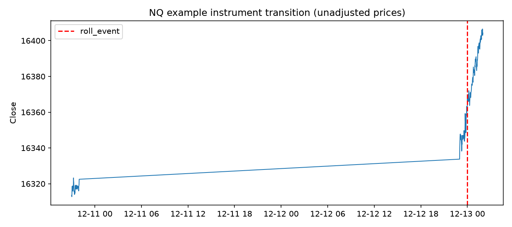

# Processed Dataset Report

**Status: PASS — 25,205,190 raw OHLCV rows were preserved and all 440 Phase 1 transitions reconciled.**

The canonical dataset is compressed Parquet under `D:\futures-ml-data\processed\bars_1m`, partitioned by root and UTC year. Prices are Databento fixed-point integers converted by `1e9`; no resampling, forward filling, candle fabrication, or price back-adjustment was performed.

## Per-root audit

| Root | Raw rows | Processed | Coverage UTC | Segments | Rolls | Non-1m intervals | Missing clock minutes | 240-bar warm-up nulls | Missing exact-time rows | Roll-guard rows | ML eligible |
|---|---:|---:|---|---:|---:|---:|---:|---:|---:|---:|---:|
| NQ | 1,769,895 | 1,769,895 | 2021-09-23T00:00:00+00:00 to 2026-09-22T23:59:00+00:00 | 21 | 20 | 1,653 | 859,544 | 5,019 | 100,416 | 5,337 | 1,757,951 |
| ES | 1,769,621 | 1,769,621 | 2021-09-23T00:00:00+00:00 to 2026-09-22T23:59:00+00:00 | 21 | 20 | 1,936 | 859,819 | 5,019 | 102,651 | 5,346 | 1,757,391 |
| RTY | 1,716,497 | 1,716,497 | 2021-09-23T00:00:00+00:00 to 2026-09-22T23:59:00+00:00 | 21 | 20 | 41,374 | 912,915 | 5,019 | 298,933 | 4,859 | 1,663,353 |
| ZF | 1,606,925 | 1,606,925 | 2021-09-23T00:00:00+00:00 to 2026-09-22T23:59:00+00:00 | 21 | 20 | 101,173 | 1,016,397 | 5,019 | 505,399 | 4,126 | 1,485,882 |
| ZN | 1,664,174 | 1,664,174 | 2021-09-23T00:00:00+00:00 to 2026-09-22T23:58:00+00:00 | 21 | 20 | 74,838 | 962,246 | 5,019 | 425,636 | 4,604 | 1,574,020 |
| ZB | 1,539,652 | 1,539,652 | 2021-09-23T00:01:00+00:00 to 2026-09-22T23:59:00+00:00 | 21 | 20 | 139,359 | 1,086,633 | 5,019 | 624,300 | 3,854 | 1,379,731 |
| CL | 1,746,831 | 1,746,831 | 2021-09-23T00:00:00+00:00 to 2026-09-22T23:59:00+00:00 | 61 | 60 | 19,349 | 829,146 | 14,579 | 179,705 | 15,043 | 1,706,946 |
| NG | 1,583,981 | 1,583,981 | 2021-09-23T00:02:00+00:00 to 2026-09-22T23:59:00+00:00 | 63 | 62 | 120,697 | 993,599 | 15,057 | 540,822 | 12,839 | 1,439,345 |
| GC | 1,748,524 | 1,748,524 | 2021-09-23T00:00:00+00:00 to 2026-09-22T23:59:00+00:00 | 26 | 25 | 10,947 | 871,378 | 6,214 | 128,951 | 6,291 | 1,725,650 |
| HG | 1,682,393 | 1,682,393 | 2021-09-23T00:00:00+00:00 to 2026-09-22T23:59:00+00:00 | 26 | 25 | 63,246 | 940,898 | 6,214 | 342,023 | 6,070 | 1,606,494 |
| 6E | 1,738,726 | 1,738,726 | 2021-09-23T00:00:00+00:00 to 2026-09-22T23:59:00+00:00 | 21 | 20 | 31,836 | 887,132 | 5,019 | 234,705 | 4,999 | 1,696,086 |
| 6J | 1,732,858 | 1,732,858 | 2021-09-23T00:00:00+00:00 to 2026-09-22T23:59:00+00:00 | 21 | 20 | 35,379 | 893,035 | 5,019 | 257,855 | 5,036 | 1,686,636 |
| 6B | 1,631,257 | 1,631,257 | 2021-09-23T00:00:00+00:00 to 2026-09-22T23:58:00+00:00 | 21 | 20 | 98,256 | 994,401 | 5,019 | 461,669 | 4,385 | 1,521,400 |
| ZC | 1,056,804 | 1,056,804 | 2021-09-23T00:00:00+00:00 to 2026-09-22T18:19:00+00:00 | 33 | 32 | 141,357 | 1,515,711 | 7,863 | 622,927 | 5,704 | 893,567 |
| ZS | 1,176,130 | 1,176,130 | 2021-09-23T00:00:00+00:00 to 2026-09-22T18:19:00+00:00 | 26 | 25 | 91,304 | 1,401,900 | 6,214 | 566,964 | 5,657 | 1,066,090 |
| ZW | 1,040,922 | 1,040,922 | 2021-09-23T00:00:00+00:00 to 2026-09-22T18:19:00+00:00 | 32 | 31 | 147,201 | 1,550,277 | 7,648 | 626,391 | 4,909 | 872,182 |

## Totals and interpretation

- Raw rows: **25,205,190**.
- Canonical rows: **25,205,190** (zero raw-row loss).
- Contract segments: **456**.
- Rollovers: **440**, exactly matching Phase 1.
- Primary-target/240-bar-warm-up eligible rows: **23,832,724** (94.55%).

`non_one_minute_intervals` and `missing_clock_minutes` describe real timestamp gaps inside a contract segment; they are not filled. Large totals are expected around exchange/session closures and quiet periods. Exact-time returns and labels are null when their required timestamp is absent. `roll-guard rows` is an overlapping diagnostic count within 240 minutes after or 15 minutes before a roll, not an additional unique deletion count.

The initial all-features-non-null diagnostic retained only 58.52% and was investigated before modeling. The cause was expected session gaps and undefined flat-bar ratios—not raw corruption. The final eligibility rule requires a valid exact 5-minute target and completed 240-observation segment warm-up; remaining feature nulls are handled only by train-fitted median imputation.

